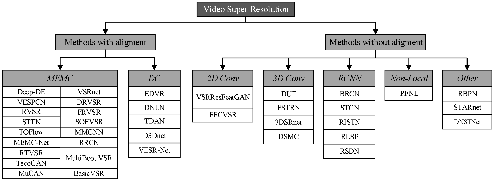

# This repo is built for paper: Video Super Resolution Based on Deep Learning: A Comprehensive Survey【[paper](https://arxiv.org/abs/2007.12928)】




**Citing this work**

If this repository is helpful to you, please cite our [survey](https://arxiv.org/abs/2007.12928).

```
@article{liu2020video,
  title={Video super resolution based on deep learning: A comprehensive survey},
  author={Liu, Hongying and Ruan, Zhubo and Zhao, Peng and Dong, Chao and Shang, Fanhua and Liu, Yuanyuan and Yang, Linlin},
  journal={arXiv preprint arXiv:2007.12928},
  year={2020}
}
```

🔥 (citations > 200)  

# Methods with aligment

## MEMC

| Paper                                                        | Model     | Code                                                         | Published                                                    | citations |
| ------------------------------------------------------------ | --------- | ------------------------------------------------------------ | ------------------------------------------------------------ | --------- |
| Video Super-Resolution via Deep Draft-Ensemble Learning      | Deep-DE 🔥 |                                                              | [ICCV 2015](https://openaccess.thecvf.com/content_iccv_2015/html/Liao_Video_Super-Resolution_via_ICCV_2015_paper.html) |           |
| Video Super-Resolution With Convolutional Neural Networks    | VSRnet 🔥  | [PyTorch](https://github.com/usstdqq/vsrnet_pytorch)         | [TCI 2016](https://ieeexplore.ieee.org/document/7444187)     |           |
| Real-Time Video Super-Resolution With Spatio-Temporal Networks and Motion Compensation | VESPCN 🔥  | [PyTorch](https://github.com/JuheonYi/VESPCN-PyTorch), [TensorFlow](https://github.com/JuheonYi/VESPCN-tensorflow) | [CVPR 2017](https://openaccess.thecvf.com/content_cvpr_2017/html/Caballero_Real-Time_Video_Super-Resolution_CVPR_2017_paper.html), [arXiv](http://arxiv.org/abs/1611.05250v2) |           |
|                                                              |           |                                                              |                                                              |           |
|                                                              |           |                                                              |                                                              |           |
|                                                              |           |                                                              |                                                              |           |
|                                                              |           |                                                              |                                                              |           |
|                                                              |           |                                                              |                                                              |           |


## DC


# Method without aligment

## 2D Conv


## 3D Conv


## RCNN


## Non-Local


## Other


